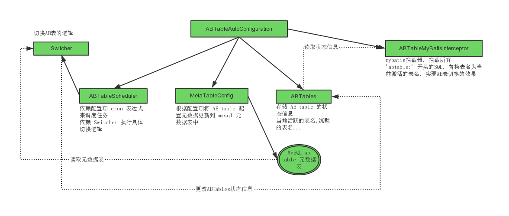
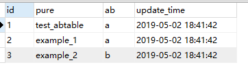
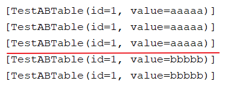
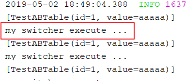

# 基于 Mybatis 的 ABTable 插件: `abtable-mybatis-spring-boot-starter`


实现 AB 表切换.

### 适用场景

1. 需要某个固定时间(每天或每周)全量更新数据表.
2. 需要保证不间断查询.
3. 不想使用主从读写分离, 因为可能只是一两个表需要全量更新. 读写分离有麻烦, 又需要更多的硬件资源.
4. springboot 环境.

### 怎么使用

本项目分两个模块:
- `abtable-mybatis-spring-boot-starter`: 启动器本身
- `demo-abtable-mybatis`: 用于演示. 稍微修改下`application.properties`, 然后运行`DemoABTableApplication.main(..)`即可看到启动器效果.

下载源码, `mvn install -DskipTests`, pom.xml中引入即可使用.
```
        <dependency>
            <groupId>com.wtgroup.abtable</groupId>
            <artifactId>abtable-mybatis-spring-boot-starter</artifactId>
            <version>0.0.1.SNAPSHOT</version>
        </dependency>
```


### 概念和约定

1. 需要AB表切换的表名, 命名规范: `纯表名`+`_`+`_a/_b`(*后缀*). 无后缀的表名就叫作 *纯表名* (`pure table name`), *后缀* 叫作`abfix`, `a/b`叫作*ab表标识*(`label`).
带后缀的表名称为*全表名*(`full table name`). 例子: `example`表会对应两个全名, `example_a` 和 `example_b`.


2. 当前正在使用的表成为 *激活* 表(active), 相对的, 称为 *沉默* 表(slience).
3. 需要嵌入AB表切换的SQL操作, 需要, 1) 涉及到的表要配置为abtable(参加*配置*), 2)mybatis配置的sql语句要以 `abtable:` 打头(大小写不敏感).


### 启动器程序架构





`ABTableAutoConfiguration` 在 Springboot 主程序启动时, 会被自动扫描到, 这是因为`META-INF/spring.factories`中的配置: 

```xml
org.springframework.boot.autoconfigure.EnableAutoConfiguration=\
  com.jfai.afs.abtable.config.ABTableAutoConfiguration
```

然后, 读取配置, 生成:

-  `ABTableScheduler` 用于调度. 可定制覆盖.
-  `ABTables` 用于存储 ab table 的状态信息. 用于 调度器 和 拦截器 读取.
-  `ABTableMybatisInterceptor` 通过拦截sql, 更改表名, 来实现 AB表 切换的效果. 为了提高效率, 仅对 `abtable:` 开头的sql执行AB切换.
-  `MetaTableConfig` 用于将配置文件中的AB table配置信息同步到mysql的元数据表中. 可以配置是否同步. 配置文件没有配置, 不同步; 有且`abtable.synchronizing=true`会覆盖元数据表相关配置.

调度基于`quartz`框架:

-  `Switcher`其中`switching()`用于执行切换AB表状态信息操作,  switcher 实例作为**单例**放入 JobDataMap 实现在 Job 间共享. 


### 配置项

TODO


### 实战演示

> 参见模块: `demo-abtable-mybatis`

案例背景: 每天早上6点定时全量更新 `test_abtable`表. 

首先, 下载源码编译jar包. 引入你的项目中. 如果你仅仅是演示下, 可以使用我提供好的 `demo-abtable-mybatis` 模块, 修改下配置, 就可以跑起来了. 

**1** mysql中准备两张全名的表: `test_abtable_a` 和 `test_abtable_b`.

**2** 配置

```properties
# 存储 ab table 元数据表的数据源相关配置
abtable.datasource.driver-class-name=com.mysql.jdbc.Driver
abtable.datasource.url=jdbc:mysql://127.0.0.1:3306/test?useUnicode=true&characterEncoding=UTF-8&useSSL=false
abtable.datasource.username=root
abtable.datasource.password=root
# 存储 ab table 配置信息的元数据表
abtable.datasource.meta-table=abtable_meta
# 每3秒执行一次,每天12点触发一次
abtable.schedule.crons=0/3 * * * * ?,0 0 12 * * ?
# 
abtable.pure-name-list=test_abtable,example_1,example_2
# abfixList 要和 pure-name-list 对应， 数目一致， 且只能是'a'和'b'
abtable.abfix-list=a,a,b
# true: 自动创建'abtable.datasource.meta-table'(若无), 上面的 pure-name-list 和 abfix-list, 若有, 则会同步到元数据表中,
# 遇到同名的 pure 会覆盖更新; 若没有上两项, 则这项不起作用
abtable.synchronizing=true
```

应用启动后, 会自动创建表: `abtable_meta`



**3** 脚本在`清空-灌入`前, 先查询这个元数据表, 判断当前谁是沉默的, 针对沉默的表执行`清空-灌入`操作. 成功后, 修改`active`的值.

下面脚本, *切换ab* 和 *更新active* 测试OK的.

```shell
# 表名(无ab后缀)
pure=test_abtable
getab="mysql -N -h 192.168.17.1 -uroot -proot -e 'select ab from test.abtable_meta where pure=\"$pure\";'"
ab=$(eval "$getab")
echo before switch: $ab
# 切换 a b
if [[ "$ab" == "a" ]];then
        ab=b
elif [[ "$ab" == "b" ]];then
        ab=a
else
	# 没有正确获取当前a,b信息 ==> 不可贸然切换 ==> 退出
	exit 50
fi
echo after switch: $ab
table_full=${table}_${ab}
echo target table: $table_full

# truncate $table_full
# sqoop into $table_full

# 更新 active
$(eval "mysql -N -h 192.168.17.1 -uroot -proot -e 'update test.abtable_meta set ab=\"$ab\" where pure=\"$pure\";'")

```

TIP: 表名/字段名若和 mysql 关键字冲突了, 需要加 '\`' 包裹. 字符串比较, 要用 `=`/`==`. 命令中需要引用变量, 需要借助 `eval`, 注意: `$(eval 命令字符串)` 或  '\`eval 命令字符串\`'.

**4** java 应用中, 会定制切换规则, 如:

每天大概在脚本任务之后一段时间内, 轮询, 查询元数据表, 查看当前的 `active` 和 时间戳, 如果 时间戳 在今日 0 点后, 说明, 当前 active 表数据时今天的新数据; 反之, 需要继续等待脚本执行完. 超过一定时间内, 还没有切换成功 => 脚本任务有问题了 => 不能切换, 且要给出警告. (在脚本任务执行成功前, 不可贸然切换, 宁愿使用旧数据).


测试代码:

```
    @Autowired
    private TestABTableMapper testABTableMapper;
    @Override
    public void run(ApplicationArguments args) throws Exception {
        while (true) {
            List<TestABTable> all = testABTableMapper.getAll();
            System.out.println(all);
            /*
            * Switcher 每个 3s 就会查询元数据表执行, 切换逻辑,
            * 手动更改元数据表的 ab 字段, 接下来就会看到查询的数据变了.
            */

            Thread.sleep(3000);
        }
    }
```


TestABTableMapper:

```
@Mapper
public interface TestABTableMapper {

    @Select("ABTABLE: select * from test_abtable_a")
    // 或: @Select("ABTABLE: select * from test_abtable")
    List<TestABTable> getAll();
}
```


效果: 




### 定制化配置

#### 定制 Switcher

新建`CustomerSwitcher`实现 `Switcher`. 

```
@Component
public class CustomerSwitcher implements Switcher {
    @Override
    public void execute(JobExecutionContext jobExecutionContext) throws JobExecutionException {
        System.out.println("my switcher execute ...");
    }
}
```


效果:




---

反馈建议: liuhejun108@163.com


